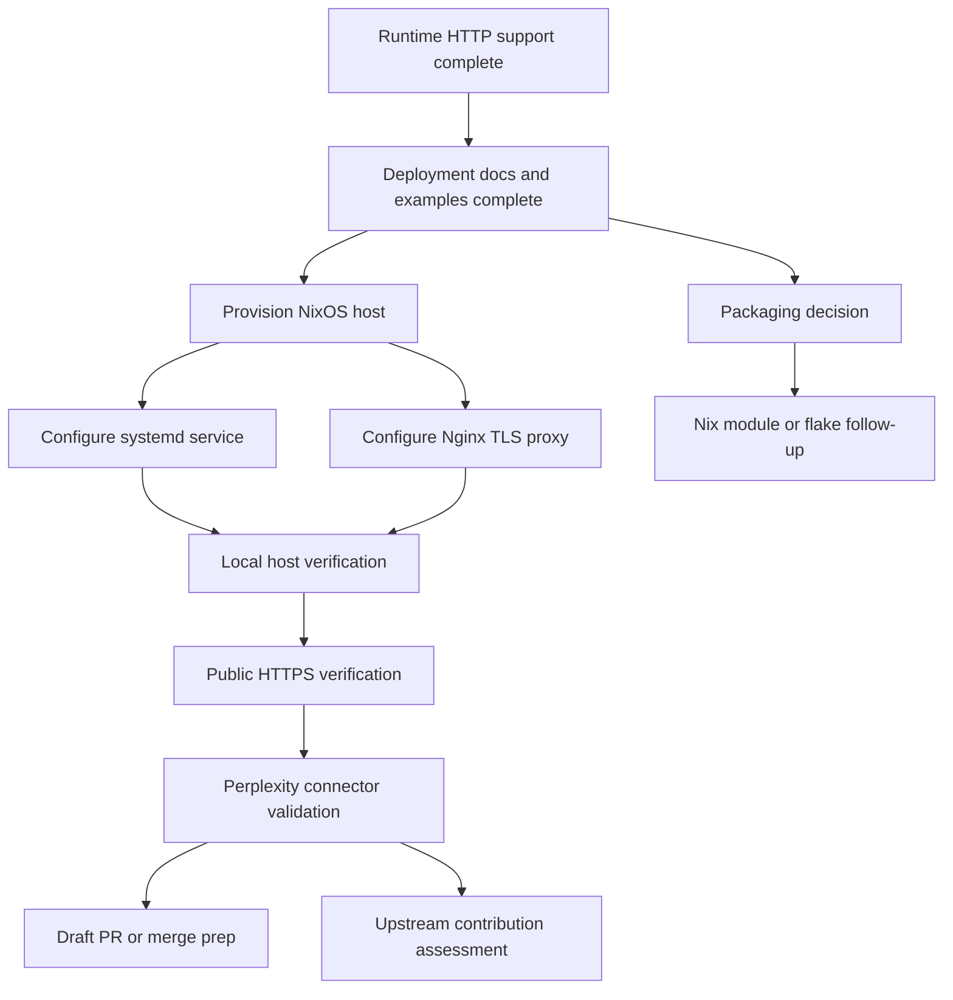

# ROADMAP.md

## Objective
Bring the fork from local verification to a real HTTPS deployment and validated Perplexity remote connector.

## Dependency graph

## Phase plan
### Phase 1: Completed baseline
- Runtime HTTP mode implemented
- Health route added
- Tests updated and passing
- Deployment docs and config examples added
- Root-level status tracking files added

### Phase 2: First live deployment
- Provision reachable NixOS host
- Apply documented service and reverse-proxy configuration
- Confirm HTTPS, `/health`, and `/mcp`

### Phase 3: Connector validation
- Create Perplexity custom remote connector
- Verify transport, endpoint path, and auth behavior
- Record any connector-specific quirks or fixes

### Phase 4: Productization follow-up
- Decide whether to add a Nix package, module, or flake
- Decide whether to upstream generic runtime changes
- Open or refine PRs based on what remains fork-specific

## Immediate next actions
- Choose whether to open a draft PR before deployment work
- Prepare the first real NixOS host deployment
- Capture deployment actions and outcomes in `actions.jsonl`
